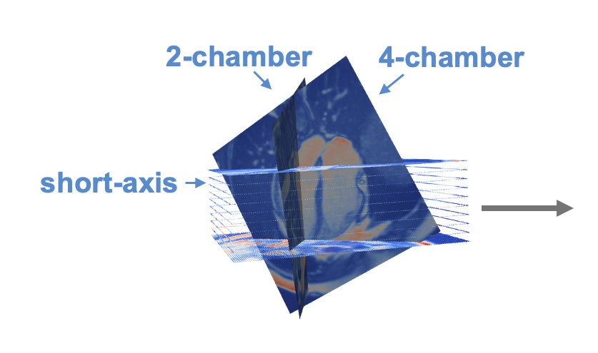

# Mesh4D: A Motion-Aware Multi-View Variational Autoencoder for 3D+t Mesh Reconstruction
**Official implementation of the MICCAI 2025 paper**  
> Qiao M.\*, Zheng J.\*, Zhang W., Ma Q., Li L., Kainz B., O'Regan D., Matthews P., Niederer S., Bai W.  
> \* Equal contribution


## Overview

**Mesh4D** is a motion-aware deep generative model for reconstructing high-resolution, temporally smooth 3D+t cardiac meshes directly from multi-view cardiac MRI. The method integrates a multi-view cross-attention encoder, transformer-based variational latent dynamics, and a continuous deformation decoder for anatomically consistent and physiologically plausible 4D heart reconstruction.

<table align="center">
  <tr>
    <td align="center">
      <br/>
      <em>Multi-view CMR inputs</em>
    </td>
    <td align="center">
      <br/>
      <em>Mesh4D reconstructed mesh</em>
    </td>
  </tr>
</table>


## Features

- 🧠 Transformer-based VAE for capturing long-range temporal dependencies  
- 📐 Continuous deformation decoder for temporally smooth and high-resolution 3D+t meshes  
- 🔄 Cross-view feature fusion with attention mechanisms  
- ⚡ Inference speed < 3 seconds for full-sequence 4D mesh reconstruction  
- 📊 Benchmarked on UK Biobank cardiac MRI (1,984 subjects)


## Installation

```bash
git clone https://github.com/your-username/Mesh4D.git
cd Mesh4D
conda env create -f environment.yml
conda activate mesh4d
```
